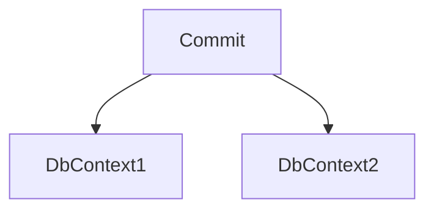
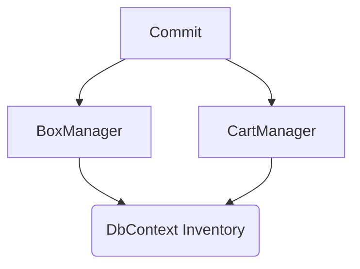
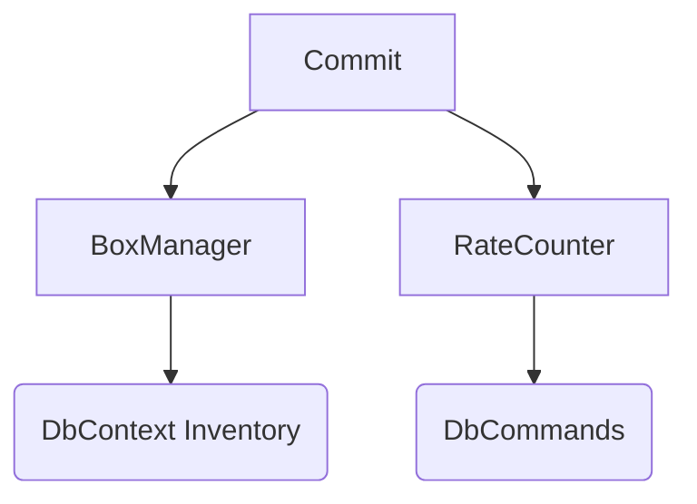
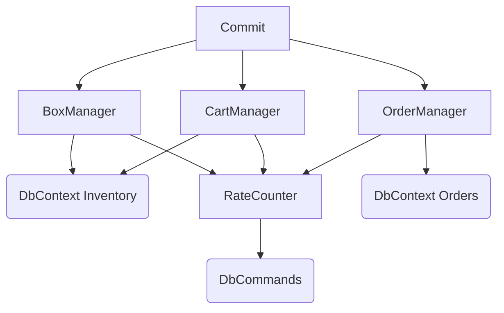

# Phaneritic
Very visible .NET code framework for building services upon.  
Phaneritic rocks include granite and peridotite.  
They are igneous rocks with large crystals (phenocrysts) visible to the unaided eye. 

> Thanks to [Wikipedia](https://en.wikipedia.org/wiki/Phanerite) and `hemlock-qwen2.5-coder-14b` running in **LMStudio** hooked onto **VSCode** for helping "complete" the above description, but not this aside...(¡ that's all me !)

Like an igneous intrusion (or pluton), this code has cooled over time and worked it's way to the surface.  
By publicizing it, I am hoping its structures will be visible to the unaided developer eye, and might provide some utility for others.  
Also, since almost all my code has been hidden under corporate ground for most of my career, this intrusion demonstrates that there have been forces at work which could not be seen.

## Major Feature Areas
The following lists the major features areas in terse summary form.  
The first two I'd previously isolated and made some repositories to explain the basics, they live here in their "native" original form.

- [Primitive obsession avoidance](https://github.com/sageikosa/PrimitivelyStrong)
- Synchronizing access to [critical sections](https://github.com/sageikosa/TaskGateKeeper) in async code
- Database connection injection
- Multiple EF `DbContext` instances in one transaction
- `SqlCommand` invocation also within EF `DbContext` transaction
- Entity to Dto Packing
- Configuration and slow-changing code-available data caching
- Startup seeding for host builder type applications

## Database Connection Injection

## Multiple Interdependent Work Units in One Transaction
Let's assume for a moment that you are like me, and for reasons, you don't want one massive `DbContext` model to rule them all.  
But, you still need to ensure that changes in two (or more) `DbContext`s get committed together.  

Or more likely you may have two or more "higher-level" data-management classes that use the same `DbContext` to manipulate data, and you don't need to know about the databases per se.

Further, you may have a mix of EF updates and SQL SPROC calls that should _really_ commit or fail as a unit.

and so forth in increasingly complex connectivity and depth

## Dto Packing

## Lud Caching

## Kick Starting Refreshables
