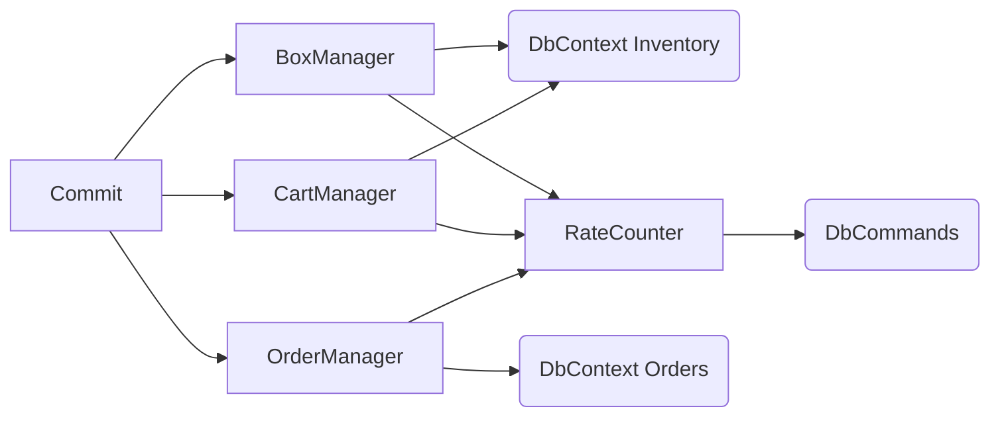

# Phaneritic
Very visible .NET code framework for building services upon.  
Phaneritic rocks include granite and peridotite.  
They are igneous rocks with large crystals (phenocrysts) visible to the unaided eye. 

> Thanks to [Wikipedia](https://en.wikipedia.org/wiki/Phanerite) and `hemlock-qwen2.5-coder-14b` running in **LMStudio** hooked onto **VSCode** for helping "complete" the above description, but not this aside...(¡ that's all me !)

Like an igneous intrusion (or pluton), this code has cooled over time and worked it's way to the surface.  
By publicizing it, I am hoping its structures will be visible to the unaided developer eye, and might provide some utility for others.  
Also, since almost all my code has been hidden under corporate ground for most of my career, this intrusion demonstrates that there have been forces at work which could not be seen.

## Major Feature Areas
The following lists the major features areas in terse summary form.  
The first two I'd previously isolated and made some repositories to explain the basics, they live here in their "native" original form.

- [Primitive obsession avoidance](https://github.com/sageikosa/PrimitivelyStrong)
- Synchronizing access to [critical sections](https://github.com/sageikosa/TaskGateKeeper) in async code
- Database connection injection
- Multiple EF `DbContext` instances in one transaction
- `SqlCommand` invocation also within EF `DbContext` transaction
- Entity to Dto Packing
- Configuration and slow-changing code-available data caching
- Startup seeding for host builder type applications

As a late addition, I added some of the operational services and logging services I use in my Warehouse Operations System code, but I've omitted the ledgering tables, relations and entities for inventory, demands, fulfillment and movement tracking, since they're specific to warehouse intralogistics.

## Database Connection Injection
Phaneritic supports two database connection types, the main transactional [work connection](https://github.com/sageikosa/Phaneritic/blob/main/Phaneritic.Implementations/Database/DbScopedConnection.cs) and a [logging connection](https://github.com/sageikosa/Phaneritic/blob/main/Phaneritic.Implementations/Database/DbLoggingConnection.cs).

## Multiple Interdependent Work Units in One Transaction
Let's assume for a moment that you are like me, and for reasons, you don't want one massive `DbContext` model to rule them all.  
But, you still need to ensure that changes in two (or more) `DbContext`s get committed together.  
...or more likely you may have two or more "higher-level" data-management classes that use the same `DbContext` to manipulate data, and you don't need to know about the databases per se.  
...or further, you may have a mix of EF updates and SQL SPROC calls that should _really_ commit or fail as a unit.  
and so forth in increasingly complex connectivity and depth

[`IContributeWork`](https://github.com/sageikosa/Phaneritic/blob/main/Phaneritic.Interfaces/CommitWork/IContributeWork.cs) defines the contract to contibute work during and after transaction processing.  
It is implemented by classes that need to participate in transaction processing.  
Implementors should commit any work they are directly responsible for and return a set of additional work contributors to be processed recursively.  

For example, [`BaseDbCommands`](https://github.com/sageikosa/Phaneritic/blob/main/Phaneritic.Implementations/Database/BaseDbCommands.cs) implements `ContributeWork` by executing the commands that have been added to it, and implements `ContributeAfterWork` by clearing the commands since they had been committed.  
Also, [`BaseDbContext`](https://github.com/sageikosa/Phaneritic/blob/main/Phaneritic.Implementations/EF/BaseDbContext.cs) implements `ContributeWork` by calling `SaveChanegs`, and implements `ContributeAfterWork` by clearing the change tracker since they had been committed.  

[`IWorkCommitter`](https://github.com/sageikosa/Phaneritic/blob/main/Phaneritic.Interfaces/CommitWork/IWorkCommitter.cs) defines the interface for committing work by providing a list of work contributors.  
It is implemented by [`WorkCommitter`](https://github.com/sageikosa/Phaneritic/blob/main/Phaneritic.Implementations/CommitWork/WorkCommitter.cs)

`WorkCommitter` uses a .NET `TransactionScope`, and in practice, using the same dependency scoped connection for multiple database executions and `DbContext` saves should be fairly easy to implement without having to worry about distributed transactions.

## Dto Packing
Data transfer objects (Dtos) are representations of entities packed for transport across system boundaries.  
Dtos are defined in the "Interfaces" project/assembly so that they can be imported into implementation and client projects.  
[`IPackRecord<TModel,TDto>`](https://github.com/sageikosa/Phaneritic/blob/main/Phaneritic.Interfaces/IPackRecord.cs) is a contract that defines packing operations usable in implementations returning Dtos.  
I have deliberately left out unpacking.  
Conventionally, `FrozenSet<>` and `FrozenDictionary<,>` are used for collections to ensure immutability, necessary for caching scenarios.  
The base interface defines a default `GetFrozenSet(...)` to support packing implementations.

```csharp
public interface IPackRecord<in TModel, TDto>
    where TDto: class, IEquatable<TDto>
{
    [return: NotNullIfNotNull(nameof(model))]
    TDto? Pack(TModel? model);

    /// <summary>Default interface implementation using <see cref="Pack(TModel?)"/></summary>
    public IEnumerable<TDto> GetDtos(IEnumerable<TModel> models)
        => models.Select(x => Pack(x)).OfType<TDto>();

    public FrozenSet<TDto> GetFrozenSet(IEnumerable<TModel>? models)
        => models == null
        ? []
        : models.Select(x => Pack(x)).OfType<TDto>().ToFrozenSet();
}
```

The `Pack` method implementations are all very similar and usually can follow the same pattern.  
All the Dto packing implementations are hand-cranked currently, but assisted by Visual Studio's very generous AI auto-complete due to their regularity.  
I looked at using _AutoMapper_, but figured that the time to learn some elaborate tricks and annotate, versus me just pumping these out with auto-complete wasn't worth it currently.
```csharp
    [return: NotNullIfNotNull(nameof(model))]
    public OptionGroupDto? Pack(OptionGroup? model)
        => model != null
        ? new()
        {
            OptionGroupKey = model.OptionGroupKey,
            Description = model.Description,
            ValidOptionTypeKeys = (model.OptionTypes?.Select(_ot => _ot.OptionTypeKey).ToHashSet() ?? []).ToFrozenSet()
        }
        : null;
```

## Lud Caching
Lookup data (Lud) caching keeps in-memory snapshots of relatively stable lookup data, indexed by key values.  
An [`ILudDictionary<TKey, TDto>`](https://github.com/sageikosa/Phaneritic/blob/main/Phaneritic.Interfaces/LudCache/ILudDictionary.cs) can be used in place of a query to the underlying database table sourcing the Dtos in the LudDictionary.  
In the UI this often manifests as lookup stitching and drop-down list entries.  
`BaseLudDictionary<TKey, TLud>` defines the default implementation and is registered as a generic singleton.

Other relevant interfaces include:  
| Interface                         | Use  |
|-----------------------------------|------|
| `ILudCacheable<TKey>`             | Marks a Dto type as cacheable and defines the index key type, used to help ensure valid setup and use |
| [`ILudCacheRefresher`](https://github.com/sageikosa/Phaneritic/blob/main/Phaneritic.Interfaces/LudCache/ILudCacheRefresher.cs)              | Refreshes a single `LudDictionary`, typically implemented as a derived class of [`LudCacheRefresherBase`](https://github.com/sageikosa/Phaneritic/blob/main/Phaneritic.Implementations/LudCache/LudCacheRefresherBase.cs) |
| [`ILudCacheFreshness`](https://github.com/sageikosa/Phaneritic/blob/main/Phaneritic.Interfaces/LudCache/ILudCacheFreshness.cs)              | Capabilities to manage all current local process freshnesses |
| `ILudCacheGetFreshness<TRefresh>` | Get process local freshness for a specific `ILudCacheRefresher` |
| [`ILudCacheFreshnessNotify`](https://github.com/sageikosa/Phaneritic/blob/main/Phaneritic.Interfaces/LudCache/ILudCacheFreshnessNotify.cs)        | Implement on a class to contribute work on refresh notifications, such as refreshing a complex dependent caching service |
| `ILudCacheRefreshAll`             | Refreshes every `LudDictionary` that is missing or out of date; notifies relevant `ILudCacheRefreshNotify` dependencies |
| [`ILudCacheUpdate<TRefresh>`](https://github.com/sageikosa/Phaneritic/blob/main/Phaneritic.Interfaces/LudCache/ILudCacheUpdate.cs)       | To be used when the underlying tabular data is changed for a specific `ILudCacheRefresher` |

To improve the efficiency of defining and registering refreshers, a T4 Template [`LudRefreshers.tt`](https://github.com/sageikosa/Phaneritic/blob/main/Phaneritic.Implementations/LudCache/LudRefreshers.tt) is defined and uses data from [`Refreshers.txt`](https://github.com/sageikosa/Phaneritic/blob/main/Phaneritic.Implementations/LudCache/Refreshers.txt) to generate classes and dependency setup calls.

## Kick Starting Refreshables
There is a general facility to kick-start (singleton?) dependencies that need to be seeded before the application is running.  All Lud Caching goes through this.

To participate any class that needs to be seeded at startup must implement [`IKickStart`](https://github.com/sageikosa/Phaneritic/blob/main/Phaneritic.Implementations/Startup/IKickStart.cs) and register itself as a scoped service.

